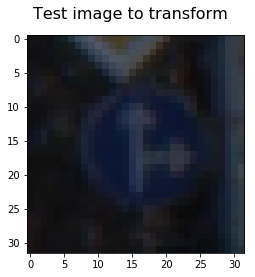
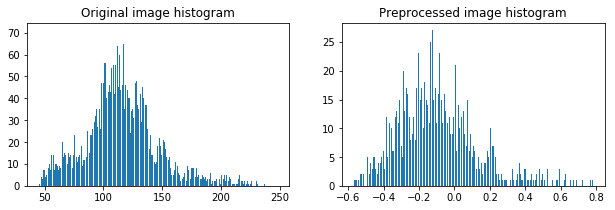
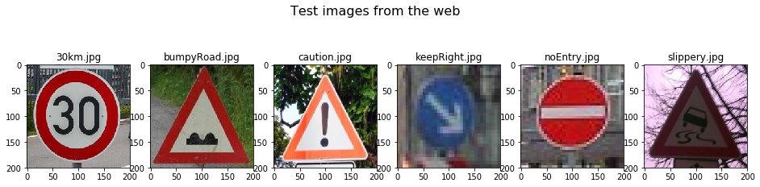
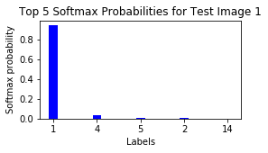
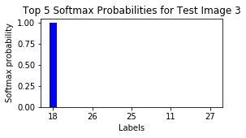
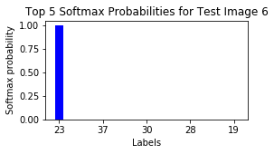

## Traffic Sign Recognition Program
In this project, deep neural networks are used to classify traffic signs. The model is trained so it can decode traffic signs from natural images by using the [German Traffic Sign Dataset](http://benchmark.ini.rub.de/?section=gtsrb&subsection=dataset). After the training, the model program is tested on new images of traffic signs found on the web. 

The working code in Python along with partial outputs is presented in [Jupyter Notebook file](Traffic_Sign_Classifier.ipynb) or equivalent [HTML document](Traffic_Sign_Classifier.html).

The goals / steps of this project are the following:

- Load the data set (see below for links to the project data set)
- Explore, summarize and visualize the data set
- Design, train and test a model architecture
- Use the model to make predictions on new images
- Analyze the softmax probabilities of the new images
- Summarize the results with a written report

### Data Set Summary & Exploration
To calculate summary statistics of the traffic signs data set the [Numpy](http://www.numpy.org/) library is used:

The size of training set is 34799
The size of the validation set is 4410
The size of test set is 12630
The shape of a traffic sign image is (32, 32, 3)
The number of unique classes/labels in the data set is 43

Here is an exploratory visualization of the data set.   
  
This bar chart is showing how many images there are in the traninig set for each label.   
  
Below, there are signs from the same label to have an idea of how different they can be (various light conditions, different angles etc.)  
  

### Data preprocessing
I decided to generate additional data because in the chart above it can be seen that many traffic signs are underrepresented comparing to the most frequent ones. To obtain the data balance, I generated additional images so that each label has about 3200 samples (which is 4 times the mean number of samples per label before this operation). Such data augmentation provides also additional information to the model because while genereating images I randomly rotated and changed the brightness of images (using OpenCV library).
Below, there are some examples of new images generation.   
   
The new training data set has been increased from 34799 to 139148 samples. The validation and test set remained untouched. 

As a next step, I decided to convert the images to grayscale because it makes 3 times less the data which strongly influences on the training time. In addition, it has been shown in this [paper](http://yann.lecun.com/exdb/publis/pdf/sermanet-ijcnn-11.pdf) describing analogous problem that such operation helps in obtaining better results. At an early stage of my model architecture I trained the model for 20 epochs for RGB, YUV and Grey-scale and the latest one gave the best results. 
I also normalized the image data to be between -1 and 1. It prevents from the numerical unstabilities which can ocuur when the data resides far away from zero. Some other normalizations like 0.1-1.0 didn't change much in the final accuracy.

Here is an example of a traffic sign image before and after grayscaling and normalization. Below, the histograms of both images are depicted.   
  
  

### Design and Test a Model Architecture
My final model architecture is the [LeNet](http://yann.lecun.com/exdb/publis/pdf/lecun-01a.pdf) convolutional neural network which proved to work on many similar problems, especially for image classification. The model consists of two convolution layers and three fully connected layers. Average pooling was used. 

The model consisted of the following layers:

| Layer         		|     Description	        					| 
|:---------------------:|:---------------------------------------------:| 
| Input         		| 32x32x1 Greyscale image   							| 
| Convolution 5x5     	| 1x1 stride, valid padding, outputs 28x28x6 	|
| RELU					|												|
| Avg pooling	      	| 2x2 stride,  outputs 14x14x6  				|
| Convolution 5x5	    |  1x1 stride, valid padding, outputs 10x10x16 	|
| RELU					|												|
| Avg pooling	      	| 2x2 stride,  outputs 5x5x16  				|
| Fully connected		| inputs 400, outputs 120        									|
| RELU					|		
| Fully connected		| inputs 120, outputs 84        									|
| RELU					|		
| Fully connected		| inputs 84, outputs 43        									|
| Softmax				|        									|

To train the model, I used the Adam Optimizer. The batch size was 128 and number of epochs equaled 200. Initial learning rate was set on 0.003. L2 loss function was added to the main loss for the regularization with the weight 0.0001.

I followed an iterative process of finding the best model architecture. I changed one of the parameters or tried one architecture modification, ran 20 epochs and obsesrved the validation error. For each hyperparameters, i.e. learning rate and L2 loss function, I tried to find the optimum value. During such process I tried dropout technique but it didn't help to achieve better accuracy. Pooling type also did't influence the model much. 

It's worth to mention that using the same iterative process I played with preprocessing techniques much. I found that for this case the grey-scale images are optimum inputs for the model. Also image training set augmentation really helped with random image transformations (only changing rotation and brightness).

From the initial LeNet model taken from the Udacity course which was designed for MNIST problem I improved the model from 90% to 96.8% validation accuracy. I was mainly looking at this parameter instead of learning accuracy to prevent overfitting. 

My final model results were:

- Training set accuracy of <b>99.5 %</b>
- Validation set accuracy of <b>96.8 %</b>
- Test set accuracy of <b>94.6 %</b>

Below, there are details of intermediate steps that I took and the corresponding validation accuracies after 20 epochs of training:
Sometimes the differences between 2 given approaches seem to be huge but note that for each training procedure there is random weight initialization which influences the final error, especially when number of epochs is small. That's why during final model tuning I used more than 20 epochs - about 100.
- Initial LeNet model, choosing input images color representation - 91 %
- Input images normalization - ~91 %
- Training set augmantation - 93 %
- Learn rate optimization, from this stage I tested for more epochs (100) - 95 %
- Finding optimum image transformations during training set augmentation - 96 %
- Trying different pool methods, trying dropout, choosing L2 loss, tuning learn rate again - 96.8

### Test a Model on New Images

Here are five German traffic signs that I found on the web:

  

It wasn't easy to find examples which are of bad quality and could be a problem for the classifier. Most of the new found images are clear and I expected that the model should work properly for most of them. I noticed that when the accuracy on the test set was about 90% (before final model tuning) at least one of the new images shown here was wrongly classified. When test set accuracy went to the final 94.6% all 6 new images were classified perfectly. 

Here are the results of the prediction:

| Image			        |     Prediction	        					| 
|:---------------------:|:---------------------------------------------:| 
| Speed limit (30km/h)      		| Speed limit (30km/h)  									| 
| Bumpy road     			|Bumpy road										|
| General caution					| General caution											|
| Keep right	      		| Keep right			 				|
| No entry			| No entry     							|
| Slippery road			| Slippery road    							|

The model was able to correctly guess 6 of the 6 traffic signs, which gives an accuracy of 100%. This compares favorably to the accuracy on the test set of 94.6%.

The code for making predictions on my final model is located in the 9th cell of the Ipython notebook.

For all 6 images the final model was very certain about its result. Only for the first sign (Speed limit 30km/h) the model was "only" 94% certain about the output. The second and third guess for this sign were other speed limit signs.   
  

For the rest of images the model was more than 99%b sure about its prediction.  

